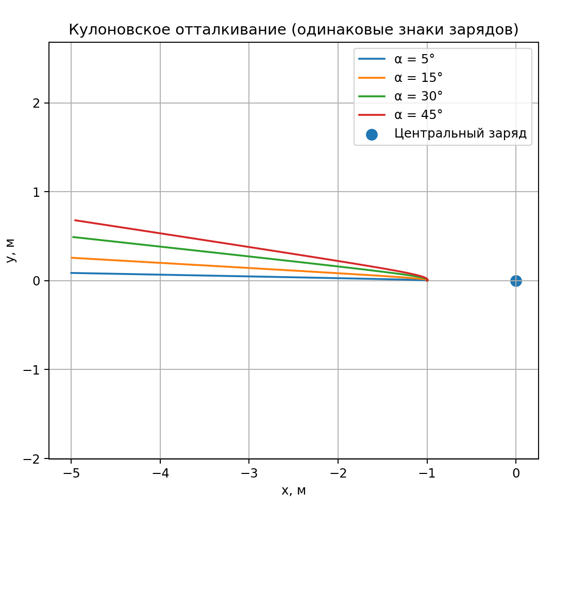
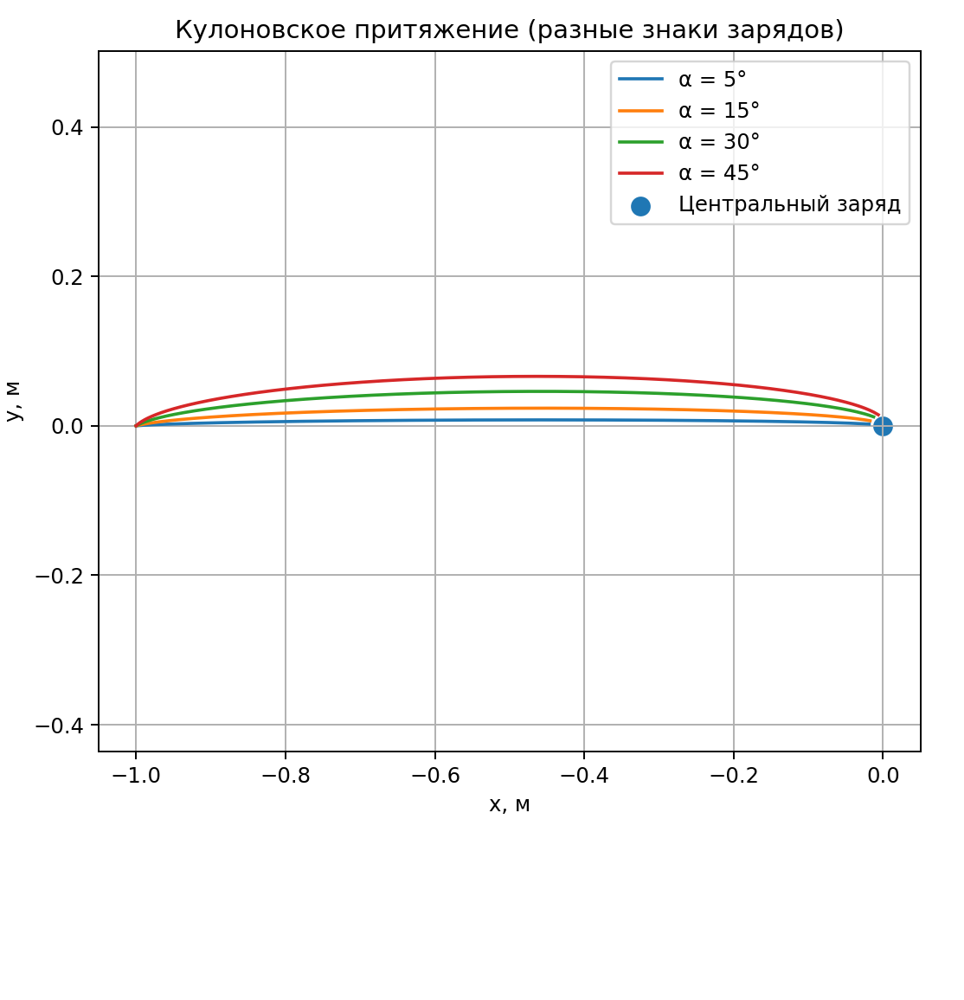
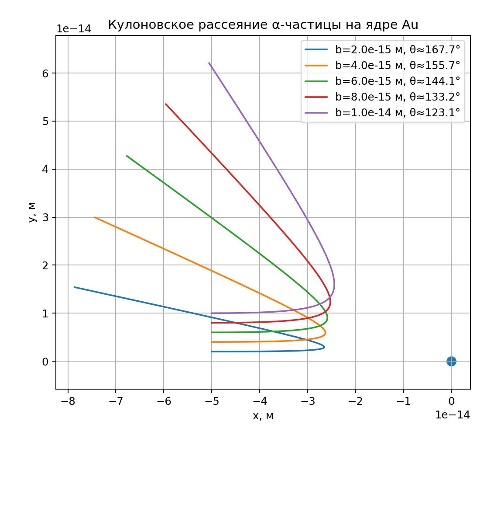

# Моделирование движения заряженной частицы в кулоновском поле  
*(раздел 6.2, Маликов)*

## Введение

В данной работе выполнено численное моделирование движения заряженной частицы в кулоновском поле неподвижного точечного заряда. Дополнительно рассматривается классическая задача рассеяния Резерфорда — движение α-частицы в кулоновском поле ядра золота.

Моделирование выполнено на языке **Python** с использованием численных методов решения систем дифференциальных уравнений. Целью работы является исследование характера траекторий движения частицы и зависимости движения от знаков зарядов и начальных условий.

---

## 1. Постановка задачи

Рассматривается движение частицы массы *m* и заряда *q* в плоскости под действием электростатического поля неподвижного точечного заряда *Q*, расположенного в начале координат.

В работе исследуются следующие случаи:

- движение частицы при одинаковых знаках зарядов (кулоновское отталкивание);
- движение частицы при разных знаках зарядов (кулоновское притяжение);
- рассеяние α-частицы в кулоновском поле ядра золота (задача Резерфорда).

Движение рассматривается в рамках классической механики.

---

## 2. Математическая модель

### 2.1 Уравнение движения

Движение частицы описывается вторым законом Ньютона:

\[
m \frac{d^2 \vec{r}}{dt^2} = \vec{F}
\]

Сила кулоновского взаимодействия имеет вид:

\[
\vec{F} = \frac{Q q}{r^3} \vec{r}
\]

где  
\(\vec{r} = (x, y)\) — радиус-вектор частицы,  
\(r = \sqrt{x^2 + y^2}\).

Характер взаимодействия определяется знаком произведения \(Q \cdot q\).

---

### 2.2 Система уравнений в координатной форме

В декартовой системе координат уравнения движения записываются следующим образом:

\[
\begin{aligned}
\frac{dx}{dt} &= v_x, \\
\frac{dy}{dt} &= v_y, \\
\frac{dv_x}{dt} &= \frac{Q q}{m} \frac{x}{(x^2 + y^2)^{3/2}}, \\
\frac{dv_y}{dt} &= \frac{Q q}{m} \frac{y}{(x^2 + y^2)^{3/2}}.
\end{aligned}
\]

Данная система полностью соответствует уравнениям, приведённым в методическом пособии (раздел 6.2).

---

### 2.3 Особенности численной модели

В численной реализации используется безразмерная форма уравнений, при которой кулоновская постоянная принята равной единице. Такой подход позволяет исследовать качественные особенности движения без привязки к конкретной системе единиц.

Для предотвращения сингулярности при малых расстояниях между частицей и центральным зарядом вводится малый параметр сглаживания.

---

## 3. Численный метод решения

Для решения системы дифференциальных уравнений используется метод Рунге–Кутты 4-го порядка (RK4), обеспечивающий высокую точность численного интегрирования.

Интегрирование прекращается при выполнении одного из условий:
- достижение малого расстояния до центрального заряда;
- удаление частицы на большое расстояние от источника поля.

---

## 4. Реализация численной модели

### 4.1 Вычисление ускорения частицы

```python
def coulomb_force_acceleration(x, y, m, q, Q, eps=1e-6):
    r_sq = x*x + y*y + eps*eps
    r = np.sqrt(r_sq)
    coef = (q * Q) / (m * r_sq * r)
    return coef * x, coef * y
```

Ускорение вычисляется на основе закона Кулона и второго закона Ньютона.

---

### 4.2 Численное интегрирование методом Рунге–Кутты

```python
def runge_kutta_step(state, dt, m, q, Q):
    k1 = equations(state, m, q, Q)
    k2 = equations(state + 0.5 * dt * k1, m, q, Q)
    k3 = equations(state + 0.5 * dt * k2, m, q, Q)
    k4 = equations(state + dt * k3, m, q, Q)
    return state + (dt / 6.0) * (k1 + 2*k2 + 2*k3 + k4)
```

---

## 5. Численные эксперименты

### 5.1 Притяжение и отталкивание зарядов

Проведено моделирование движения частицы при различных начальных углах скорости для двух случаев: одинаковые и разные знаки зарядов.

#### Кулоновское отталкивание


#### Кулоновское притяжение


---

## 6. Рассеяние Резерфорда

Во второй части работы рассматривается задача рассеяния α-частицы в кулоновском поле ядра золота.

Параметры модели:
- заряд α-частицы: \(q = 2e\);
- заряд ядра золота: \(Q = 79e\);
- масса α-частицы: \(m = 4\) а.е.м.;
- кинетическая энергия: \(E = 4\) МэВ.

Исследуется зависимость траектории движения и угла рассеяния от прицельного параметра \(b\).



---

## 7. Анализ результатов

В результате численного моделирования установлено, что:

- при одинаковых знаках зарядов частица отклоняется от центра поля;
- при противоположных знаках зарядов частица притягивается к центральному заряду;
- в задаче рассеяния Резерфорда уменьшение прицельного параметра приводит к увеличению угла рассеяния.

Полученные результаты качественно соответствуют теоретическим представлениям электростатики и классическому эксперименту Резерфорда.

---

## Заключение

В работе выполнено численное моделирование движения заряженной частицы в кулоновском поле. Реализованная модель позволяет наглядно исследовать различные режимы движения и подтверждает основные физические закономерности кулоновского взаимодействия.

Использование метода Рунге–Кутты 4-го порядка обеспечивает достаточную точность численного решения и корректность полученных результатов.

